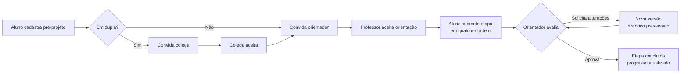

# ProTCC

**Sistema web responsivo para centralizar, gerenciar e acompanhar o desenvolvimento de Trabalhos de Conclusão de Curso (TCC).**

Projeto da disciplina **Engenharia de Software II** do curso de Bacharelado em Ciência da Computação da **Universidade Federal do Amapá (UNIFAP)** — Docente: Adeildo Telles da Silva.

---

## Sumário

- [O problema](#o-problema)
- [Proposta de valor por perfil](#proposta-de-valor-por-perfil)
- [Principais funcionalidades](#principais-funcionalidades)
- [Fluxo do sistema](#fluxo-do-sistema)
- [Fora de escopo](#fora-de-escopo)
- [Premissas técnicas](#premissas-técnicas)
- [Casos de uso](#casos-de-uso)
- [Documentação](#documentação)
- [Estrutura do repositório](#estrutura-do-repositório)
- [Equipe](#equipe)

## O problema

Hoje o acompanhamento do TCC acontece de forma fragmentada — e-mails, aplicativos de mensagem, arquivos soltos e anotações individuais. Com isso:

- **alunos** não têm clareza sobre o que já foi entregue, revisado ou aprovado;
- **orientadores** têm dificuldade para acompanhar vários orientandos e saber quais entregas aguardam sua análise;
- **a coordenação** não tem uma visão geral e atualizada para identificar atrasos, pendências ou baixa evolução.

O ProTCC unifica essa comunicação em torno das entregas, de forma clara e estruturada.

## Proposta de valor por perfil

| Perfil | O que o ProTCC oferece |
|---|---|
| **Alunos** (individual ou dupla) | Cadastram o pré-projeto, convidam parceiro de dupla e orientador, submetem entregas sem ordem fixa, enviam novas versões após correções e acompanham graficamente o progresso. |
| **Professores orientadores** | Dashboard dos orientandos com entregas pendentes de avaliação; aprovam etapas ou solicitam alterações. |
| **Coordenação do curso** | Visão analítica de todos os TCCs ativos para monitorar o andamento, identificar atrasos e mitigar gargalos. |

## Principais funcionalidades

- **Gestão de vínculos** — convites e aceites digitais para formação de duplas e definição do orientador.
- **Submissão flexível de etapas** — envio de entregas sem obrigatoriedade de ordem cronológica.
- **Histórico e versionamento inviolável** — novas versões nunca apagam as anteriores; todo feedback fica registrado.
- **Progresso automático** — barra de evolução calculada pela proporção de etapas aprovadas.
- **Dashboards por perfil** — painéis focados nas prioridades de aluno, orientador e coordenação.

## Fluxo do sistema



## Fora de escopo

Nesta versão o sistema **não** faz:

- escolha, indicação ou vinculação automática de duplas ou orientadores;
- edição ou escrita do texto do TCC dentro da plataforma;
- chat ou comunicação fora do feedback atrelado às entregas;
- agendamento ou gerenciamento de bancas e defesas, nem processos posteriores à defesa;
- emissão de documentos acadêmicos ou oficiais;
- integração com SIGAA, DERCA, biblioteca ou outros sistemas da UNIFAP.

## Premissas técnicas

| Aspecto | Premissa |
|---|---|
| **Desempenho** | Telas de consulta e dashboards carregam em até 3 s em 95% das requisições. |
| **Usabilidade** | Interface responsiva, sem rolagem horizontal em smartphones e tablets. |
| **Segurança** | Acesso somente autenticado, restrito ao perfil do usuário e aos TCCs dos quais participa. |
| **Auditoria** | Toda ação crítica (submissão, avaliação, convite, aceite) registra quem, quando e o quê. |
| **Integridade** | Nova submissão não substitui versões anteriores. |

## Casos de uso

| ID | Caso de uso | Ator principal |
|---|---|---|
| UC01 | Cadastrar pré-projeto | Aluno |
| UC02 | Formar dupla | Aluno |
| UC03 | Convidar orientador | Aluno |
| UC04 | Responder convite de orientação | Professor |
| UC05 | Submeter etapa do TCC | Aluno |
| UC06 | Avaliar entrega | Professor-orientador |
| UC07 | Consultar histórico de uma etapa | Aluno / Professor-orientador |
| UC08 | Acompanhar progresso do TCC | Aluno |
| UC09 | Acompanhar orientandos | Professor-orientador |
| UC10 | Acompanhar TCCs do curso | Coordenação |

Requisitos funcionais (RF01–RF15), não funcionais (RNF01–RNF06), regras de negócio (RN01–RN13) e a rastreabilidade completa estão na [Missão 2](docs/missao-2-das-necessidades-aos-requisitos.md).

## Documentação

| Entrega | Conteúdo | Arquivos |
|---|---|---|
| **Missão 1** – O problema antes da solução | Situação-problema, público-alvo, stakeholders, escopo inicial e fluxo proposto | [Markdown](docs/missao-1-o-problema-antes-da-solucao.md) · [PDF](docs/pdf/missao-1-o-problema-antes-da-solucao.pdf) |
| **Missão 2** – Das necessidades aos requisitos | Necessidades, RF, RNF, regras de negócio, fronteira do sistema, casos de uso e rastreabilidade | [Markdown](docs/missao-2-das-necessidades-aos-requisitos.md) · [PDF](docs/pdf/missao-2-das-necessidades-aos-requisitos.pdf) |
| **Missão 3** – Raio-X estrutural do projeto | Princípios de projeto aplicados ao UC05: decomposição, módulos, coesão, acoplamento e diário de decisões | [Markdown](docs/missao-3-raio-x-estrutural.md) |
| **Missão 4** – Mapa de responsabilidades e qualidade | Elementos candidatos e cartões CRC do UC05, riscos de coesão/acoplamento, RNFs que pressionam o projeto, teste da mudança e decisões D08–D11 | [Markdown](docs/missao-4-mapa-de-responsabilidades.md) |
| **Apresentação** | Slides do projeto (10 slides, com notas do apresentador) | [PPTX](docs/apresentacao/ProTCC_Apresentacao.pptx) |

## Estrutura do repositório

```
engsoft2-tcc/
├── README.md
└── docs/
    ├── missao-1-o-problema-antes-da-solucao.md
    ├── missao-2-das-necessidades-aos-requisitos.md
    ├── missao-3-raio-x-estrutural.md
    ├── missao-4-mapa-de-responsabilidades.md
    ├── apresentacao/
    │   └── ProTCC_Apresentacao.pptx
    └── pdf/
        ├── missao-1-o-problema-antes-da-solucao.pdf
        └── missao-2-das-necessidades-aos-requisitos.pdf
```

## Equipe

- Gustavo Carvalho Ferreira
- João Felype Palmerim Mendonça
- João Lucas Farias de Sena
- Kauê da Silva Leite
- Lucas Mateus Vilhena Alves
- Nicolas de Carvalho Lamarão Gomes
